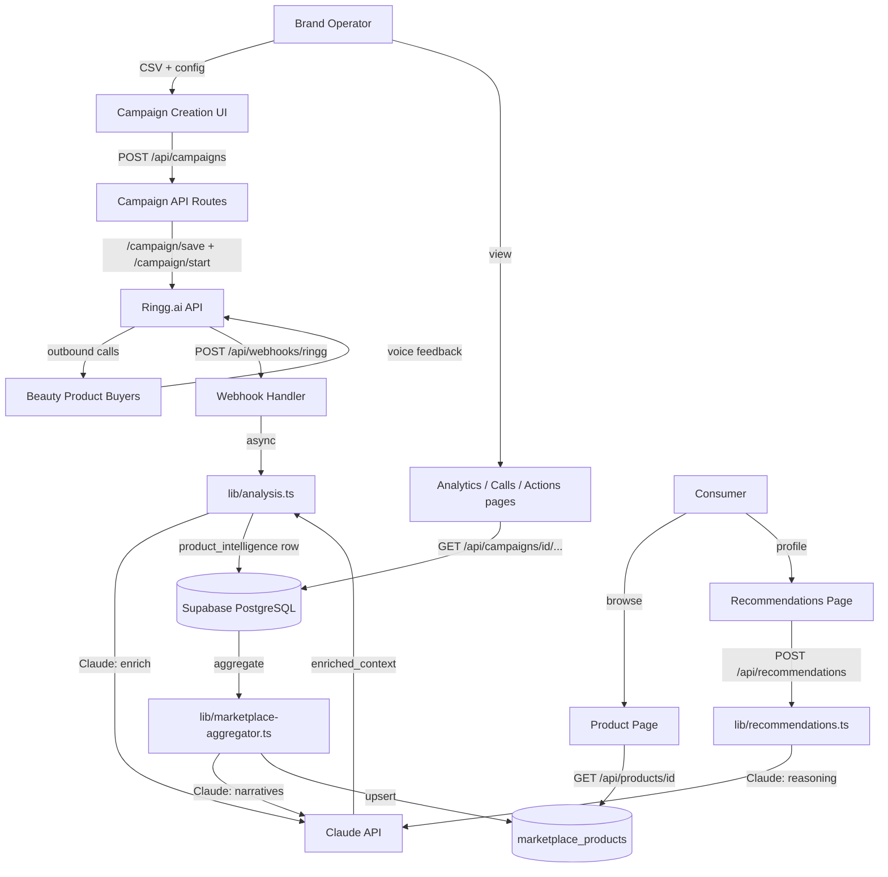
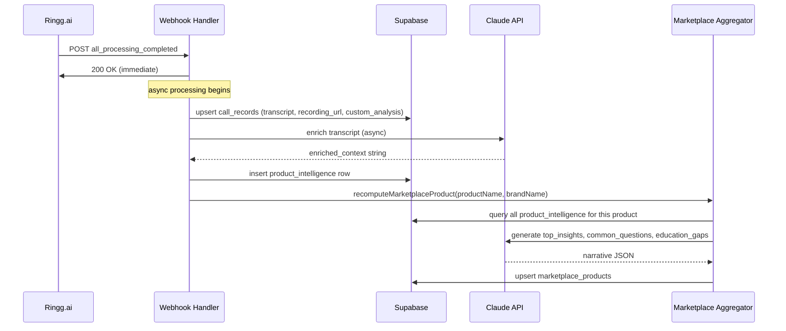
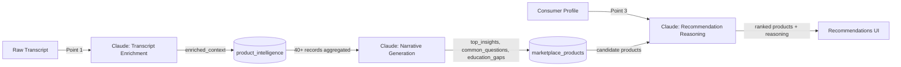

# feat: Build TrueGlow voice-verified beauty feedback platform

---

## Summary

Build TrueGlow — a full-stack Next.js 14 application on Supabase PostgreSQL that lets beauty brands run Ringg.ai outbound voice feedback campaigns on recent buyers, then surfaces structured, anonymized insights on a consumer-facing product marketplace. Claude powers three intelligence layers: transcript enrichment, marketplace narrative generation, and recommendation reasoning. Scope is six P0 pages plus the full webhook data pipeline and seed data for two products.

---

## Problem Frame

Beauty brands have no scalable, verified mechanism for structured post-purchase feedback. Star ratings are shallow; written reviews are sparse and incentive-distorted. Consumers buying beauty products face the inverse problem: product pages show aggregate stars but not "does this serum work for my oily skin, in Bengaluru humidity, layered with retinol?" TrueGlow fills both gaps with AI-conducted voice calls that collect expert-probed, beauty-specific product experience data and surface it as trust-scored product intelligence.

The build is a hackathon demo targeting four scoring parameters: end-to-end voice job completion (30pts), beauty domain nuance (30pts), credible business impact metrics (20pts), and context-preserving multi-turn conversations (20pts).

---

## Requirements

### Voice Pipeline and Campaign Management
R1. Brand operator uploads a buyer CSV, maps fields, and launches a Ringg.ai outbound voice campaign from the dashboard.
R2. System auto-detects product category from the product_name column and shows the recommended callback timing window (category-specific, from spec timing rules).
R3. Ringg.ai campaign creation and start are executed via API from the dashboard launch button.
R4. Campaign analytics page shows satisfaction radar (5 dimensions), sentiment distribution, repurchase intent, top issues, customer segments, education gaps, and key stat cards.
R5. Call records page shows all calls with status, duration, sentiment, and segment; individual rows expand to show full transcript and audio player.
R6. Action engine groups customers by recommended_action with bulk CSV export.
R7. Dashboard data derives from real Ringg.ai structured call data — not fabricated on the frontend.

### Consumer Marketplace
R8. Product page shows: Voice Trust Score (0-100 with conversation count), 5-dimension satisfaction breakdown, "Works Best For" profiles, "May Not Be Ideal For" profiles, aggregated buyer insight statements, common Q&A from real buyers, issue transparency, and repurchase signal visualization.
R9. Consumer sets a skin/hair profile and receives matched product cards with Claude-generated "why this fits you" reasoning.
R10. Marketplace has no brand-editable content — all data derives from voice call analysis.

### Data Pipeline
R11. Ringg.ai webhook handler receives `call_started`, `call_completed`, `all_processing_completed` events; responds 2xx immediately; processes asynchronously.
R12. On `all_processing_completed`: upsert call_records, extract custom_analysis into product_intelligence, trigger marketplace recomputation.
R13. Claude enriches transcripts post-webhook to surface insights beyond Ringg.ai's structured extraction.
R14. Claude generates human-readable marketplace insight statements from aggregated product_intelligence data.
R15. Claude generates "why this product for your profile" reasoning for the recommendations page.

### Demo Readiness
R16. Seed data for two products exists: Minimalist 10% Niacinamide Serum and Plum Green Tea Anti-Acne Face Wash (~40 realistic records each), loadable via `POST /api/seed`.
R17. Live pipeline is demonstrable: CSV upload → Ringg.ai campaign → webhook → dashboard update → marketplace update.

---

## Key Technical Decisions

**KTD1: Next.js 14 App Router with server and client components.** Marketplace pages use server components (fast initial load, SEO). Dashboard pages use client components for real-time chart updates. All API endpoints are Route Handlers (`route.ts`).

**KTD2: Supabase JS client (`@supabase/supabase-js` + `@supabase/ssr`).** Create a Supabase client factory with `createServerClient()` (service role key, bypasses RLS) for server-side operations and `createBrowserClient()` (anon key) for client components. Disable RLS on all tables for the hackathon, or use service role bypass throughout.

**KTD3: Webhook async processing via deferred execution.** Ringg.ai requires 2xx within ~5 seconds. Return `200 OK` immediately after auth verification, then process heavy work (Claude calls, DB writes, marketplace recomputation) using `waitUntil()` on Vercel Edge Runtime or a `setTimeout(0)` wrapper in development. All async operations are wrapped in try/catch — errors are logged but never affect the response.

**KTD4: Claude claude-sonnet-4-6 for all three integration layers.** Use `@anthropic-ai/sdk`. Rate-limit awareness: one Claude call per webhook event (not per conversation turn). Graceful degradation: if Claude fails, insert the product_intelligence row with enriched_fields=null and omit narrative text from marketplace.

**KTD5: No authentication for hackathon.** All routes are public. Brand dashboard at `/brand/*`, marketplace at `/marketplace/*`. Root `/` redirects to `/brand/campaigns`.

**KTD6: shadcn/ui + Recharts for all UI.** Install shadcn components: Card, Table, Badge, Button, Input, Progress, Tabs, Dialog, Select, Accordion. Use Recharts for all charts: RadarChart (satisfaction), PieChart (sentiment, segments), BarChart (repurchase stacked).

**KTD7: Seed data as hardcoded TypeScript in `scripts/seed.ts`.** No faker library — hardcode 40 records per product with realistic variability. Expose as `POST /api/seed` so demo setup requires no terminal access. Idempotent: deletes existing seed data for these two products before re-inserting.

**KTD8: Phone numbers hashed before storage.** Store `phone_hash` (SHA-256 of phone number), never raw phone. Store `callee_name` only in `call_records` (dashboard display), not in `product_intelligence`.

**KTD9: Environment variables.** Required: `RINGG_API_KEY`, `RINGG_AGENT_ID`, `RINGG_FROM_NUMBER_ID`, `RINGG_WEBHOOK_SECRET`, `NEXT_PUBLIC_SUPABASE_URL`, `NEXT_PUBLIC_SUPABASE_ANON_KEY`, `SUPABASE_SERVICE_ROLE_KEY`, `ANTHROPIC_API_KEY`, `NEXT_PUBLIC_APP_URL`. Only `NEXT_PUBLIC_*` vars are exposed to the browser.

---

## High-Level Technical Design

### System Architecture



### Webhook Event Flow



### Claude Integration Points



---

## Output Structure

```
trueglow/
├── app/
│   ├── layout.tsx
│   ├── page.tsx                           # redirect → /brand/campaigns
│   ├── brand/
│   │   ├── layout.tsx                     # sidebar nav
│   │   └── campaigns/
│   │       ├── page.tsx                   # campaign list
│   │       ├── new/page.tsx               # P0: campaign creation
│   │       └── [id]/
│   │           ├── analytics/page.tsx     # P0: analytics dashboard
│   │           ├── calls/page.tsx         # P0: call records + transcripts
│   │           └── actions/page.tsx       # P0: action engine
│   ├── marketplace/
│   │   ├── layout.tsx
│   │   ├── products/[id]/page.tsx         # P0: product detail
│   │   └── recommendations/page.tsx       # P0: personalized recommendations
│   └── api/
│       ├── webhooks/ringg/route.ts
│       ├── campaigns/route.ts             # GET list, POST create
│       ├── campaigns/[id]/route.ts        # GET detail
│       ├── campaigns/[id]/start/route.ts  # POST start
│       ├── campaigns/[id]/analytics/route.ts
│       ├── campaigns/[id]/calls/route.ts
│       ├── products/route.ts              # GET list
│       ├── products/[id]/route.ts         # GET detail
│       ├── recommendations/route.ts       # POST
│       └── seed/route.ts                  # POST — demo setup
├── components/
│   ├── brand/
│   │   ├── CSVUploader.tsx
│   │   ├── CampaignConfigurator.tsx
│   │   ├── CampaignProgressCard.tsx
│   │   ├── CallStatusTable.tsx
│   │   ├── TranscriptViewer.tsx
│   │   ├── AudioPlayer.tsx
│   │   ├── SatisfactionChart.tsx          # RadarChart
│   │   ├── IssueHeatmap.tsx
│   │   ├── SentimentDistribution.tsx      # PieChart
│   │   ├── RepurchaseGauge.tsx            # stacked BarChart
│   │   ├── ActionTable.tsx
│   │   ├── EducationGapReport.tsx
│   │   └── SegmentBreakdown.tsx           # PieChart
│   ├── marketplace/
│   │   ├── VoiceTrustScore.tsx
│   │   ├── SatisfactionBreakdown.tsx
│   │   ├── WorksBestFor.tsx
│   │   ├── NotIdealFor.tsx
│   │   ├── RealBuyerInsights.tsx
│   │   ├── CommonQuestions.tsx            # Accordion
│   │   ├── IssueTransparency.tsx
│   │   ├── RepurchaseSignal.tsx
│   │   ├── BuyButton.tsx
│   │   ├── ProfileSetup.tsx
│   │   └── RecommendationCard.tsx
│   └── shared/
│       ├── Navigation.tsx
│       └── Charts.tsx                     # shared Recharts wrappers
├── lib/
│   ├── supabase.ts                        # client factory
│   ├── ringg.ts                           # Ringg.ai API client
│   ├── db.ts                              # typed query functions
│   ├── types.ts                           # all TS interfaces
│   ├── analysis.ts                        # webhook → product_intelligence
│   ├── marketplace-aggregator.ts          # aggregate → marketplace_products
│   ├── recommendations.ts                 # Claude recommendation engine
│   ├── category-detector.ts               # product name → category
│   └── timing-rules.ts                    # category → optimal timing
├── db/
│   └── schema.sql
└── scripts/
    └── seed.ts
```

---

## Implementation Units

### U1. Project Scaffold and Configuration

**Goal**: Initialize the Next.js 14 project with all dependencies, folder structure, shadcn/ui setup, shared layouts, and environment configuration.

**Requirements**: Foundation for R1–R17.

**Dependencies**: none

**Files**:
- `package.json`
- `.env.local.example`
- `next.config.ts`
- `tailwind.config.ts`
- `app/layout.tsx`
- `app/page.tsx`
- `app/brand/layout.tsx`
- `app/marketplace/layout.tsx`
- `components/shared/Navigation.tsx`

**Approach**: Bootstrap with `npx create-next-app@latest trueglow --typescript --tailwind --app --src-dir=no --import-alias="@/*"`. Install runtime deps: `@supabase/supabase-js @supabase/ssr @anthropic-ai/sdk recharts papaparse`. Install shadcn/ui and add components: Card, Table, Badge, Button, Input, Progress, Tabs, Dialog, Select, Accordion. Brand layout uses a left sidebar with links to campaign list, new campaign, and settings stub. Marketplace layout uses a top bar with the TrueGlow logo and a "For Brands" link. Navigation component is the shared top-bar rendered in root layout with a brand/marketplace surface toggle. Root page redirects to `/brand/campaigns`. `.env.local.example` lists all nine required env vars with placeholder values.

**Test expectation**: none — scaffolding.

**Verification**: `npm run dev` starts without TypeScript errors; `/brand/campaigns` and `/marketplace/recommendations` routes resolve to pages; Tailwind applies; shadcn components import cleanly.

---

### U2. Supabase Schema and TypeScript Types

**Goal**: Define the database schema, run the migration on Supabase, and create all shared TypeScript types and DB query functions.

**Requirements**: R4, R5, R7, R8, R11, R12, R16

**Dependencies**: U1

**Files**:
- `db/schema.sql`
- `lib/types.ts`
- `lib/supabase.ts`
- `lib/db.ts`

**Approach**: `db/schema.sql` contains seven tables from the spec (brands, campaigns, call_records, product_intelligence, marketplace_products, consumer_profiles) plus `webhook_events (call_id TEXT, event_type TEXT, received_at TIMESTAMP, PRIMARY KEY (call_id, event_type))` for deduplication. Run via Supabase dashboard SQL editor. `lib/types.ts` exports TypeScript interfaces matching each table row exactly, plus composite types (`CampaignAnalytics`, `ConsumerProfile`, `ProductIntelligenceRow`). `lib/supabase.ts` exports `createServerClient()` using `SUPABASE_SERVICE_ROLE_KEY` (bypasses RLS) and `createBrowserClient()` using the anon key. `lib/db.ts` exports: `getCampaigns()`, `getCampaign(id)`, `createCampaign(data)`, `updateCampaign(id, patch)`, `createCallRecord(data)`, `upsertCallRecord(data)`, `insertProductIntelligence(data)`, `getProductIntelligenceForCampaign(campaignId)`, `getProductIntelligenceForProduct(productName, brandName)`, `getCallsByCampaign(campaignId, limit, offset)`, `upsertMarketplaceProduct(data)`, `getMarketplaceProduct(id)`, `getAllMarketplaceProducts()`, `getCampaignAnalyticsSummary(campaignId)`.

**Test scenarios**:
- Happy path: `getCampaign("nonexistent-id")` returns `null` without throwing.
- Happy path: `createCampaign({...})` returns the inserted row with generated UUID.
- Edge case: inserting a `call_records` row with a duplicate `ringg_call_id` throws a unique constraint error.
- Edge case: `webhook_events` composite PK prevents duplicate event processing for the same `call_id` + `event_type`.
- Integration: a `product_intelligence` row can reference a valid `campaign_id`; invalid `campaign_id` throws a foreign key error.

**Verification**: All seven tables appear in Supabase dashboard; `lib/types.ts` compiles without errors; a test insert of a campaign row saves and retrieves correctly.

---

### U3. Ringg.ai API Client and Utility Libraries

**Goal**: Implement the typed Ringg.ai API client and pure utility functions for product category detection and call timing rules.

**Requirements**: R1, R2, R3, R17

**Dependencies**: U1

**Files**:
- `lib/ringg.ts`
- `lib/category-detector.ts`
- `lib/timing-rules.ts`

**Approach**: `lib/ringg.ts` implements the `RinggClient` class exactly as documented in the origin spec: `getAssistants()`, `getNumbers()`, `createCampaign(params)` (multipart/form-data), `startCampaign(params)`, `getCampaigns()`, `getCallHistory(bulkListId, limit, offset)`, `terminateCampaign(campaignId)`, `setupWebhooks(agentId, callbackUrl, secret)`. Export a singleton `ringg` using `process.env.RINGG_API_KEY`. `lib/category-detector.ts` implements `detectCategory(productName: string): string` using the keyword map from the spec (15 categories). `lib/timing-rules.ts` implements `getTimingRule(category: string)` returning `{min, max, label}` timing windows.

**Test scenarios**:
- Happy path: `detectCategory("10% Niacinamide Serum")` returns `"skincare_serum"`.
- Happy path: `detectCategory("Green Tea Anti-Acne Face Wash")` returns `"skincare_cleanser"`.
- Happy path: `detectCategory("Onion Hair Oil")` returns `"haircare_oil"`.
- Edge case: `detectCategory("Random Product XYZ")` returns `"unknown"`.
- Happy path: `getTimingRule("skincare_serum")` returns `{min:14, max:21, label:"14-21 days"}`.
- Edge case: `getTimingRule("unknown")` returns the default `{min:7, max:14, label:"7-14 days"}`.

**Verification**: All 15 category keyword mappings return correct values; timing rules cover all categories; `RinggClient` TypeScript compiles without errors; no runtime dependencies beyond native fetch.

---

### U4. Webhook Handler and Analysis Pipeline

**Goal**: Implement the Ringg.ai webhook endpoint with immediate 2xx response, deduplication, and async processing pipeline.

**Requirements**: R11, R12, R7

**Dependencies**: U2, U3

**Files**:
- `app/api/webhooks/ringg/route.ts`
- `lib/analysis.ts`

**Approach**: The POST handler verifies `Authorization: Bearer <RINGG_WEBHOOK_SECRET>`, inserts a row into `webhook_events` (if duplicate → returns 200 immediately without reprocessing), then returns `200 OK`. All further processing runs async. `lib/analysis.ts` exports `extractProductIntelligence(callRecord, customAnalysis)` which maps Ringg.ai `custom_analysis` JSON fields to `product_intelligence` column values — field-for-field mapping as documented in the spec's custom analysis schema. It also exports `processCompletedCall(event)` which orchestrates: (1) upsert call_records with full payload; (2) extract product_intelligence fields; (3) call Claude for transcript enrichment (wrapped in try/catch); (4) insert product_intelligence row; (5) trigger `recomputeMarketplaceProduct`. Event routing: `call_started` → update campaign progress counter; `call_completed` → update call status and duration; `all_processing_completed` → run full pipeline.

**Technical design (directional)**:
```
POST /api/webhooks/ringg
  → verify Bearer token (401 if invalid)
  → insert webhook_events (conflict = duplicate, return 200 early)
  → return 200 OK
  → [async, no await]:
      switch event_type:
        'call_started': updateCampaign progress++
        'call_completed': updateCallRecord status+duration
        'all_processing_completed': processCompletedCall(event)
```

**Test scenarios**:
- Happy path: valid `all_processing_completed` event → 200 response fires within 50ms; async processing starts.
- Security: missing Authorization header → 401.
- Security: wrong token value → 401.
- Deduplication: same `call_id` + `event_type` sent twice → second request returns 200 immediately; no duplicate DB row.
- Error path: Claude API throws during enrichment → product_intelligence is still inserted with `enriched_context: null`; error logged; no 500 response.
- Integration: after valid `all_processing_completed`, a `product_intelligence` row exists in DB with correct `campaign_id` and `product_name`.

**Verification**: Webhook returns 200 in under 100ms for valid events; Supabase shows `call_records` + `product_intelligence` rows after a simulated event; auth rejects unauthorized requests.

---

### U5. Claude Integration Layer

**Goal**: Implement the three Claude intelligence touchpoints: transcript enrichment, marketplace narrative generation, and recommendation reasoning.

**Requirements**: R13, R14, R15

**Dependencies**: U2, U4

**Files**:
- `lib/marketplace-aggregator.ts`
- `lib/recommendations.ts`
- (also adds Claude calls inside `lib/analysis.ts` from U4)

**Approach**:

*Transcript enrichment* (added to `lib/analysis.ts`): After extracting `custom_analysis` fields, send the full transcript text to Claude with a prompt to identify soft signals, tone patterns, and contextual nuance beyond the structured extraction — e.g., unprompted product comparisons, underlying emotional valence, skepticism despite positive stated scores. Return as `enriched_context: string` stored in `product_intelligence`.

*Marketplace narrative generation* (`lib/marketplace-aggregator.ts`): `recomputeMarketplaceProduct(productName, brandName)` queries all `product_intelligence` rows for the product, computes: `avg_texture/effectiveness/fragrance/value/packaging`, `sentiment_distribution`, `repurchase_distribution`, `voice_trust_score` using the formula `(positiveRate×30) + (repurchaseYesRate×25) + (avgRecommendation/10×25) + ((1-severeIssueRate)×20)`, and `works_best_for`/`not_ideal_for` by grouping satisfaction averages by `skin_type` and `hair_type`. Then asks Claude to generate `top_insights` (3-5 evidence-backed statements like "78% of oily-skin users saw reduced shine in 2 weeks"), `common_questions` (Q&A pairs from `unanswered_questions_json`), and `education_gaps` (usage mistake summaries with percentages). Returns early with numeric-only data if Claude fails.

*Recommendation reasoning* (`lib/recommendations.ts`): `getRecommendations(profile: ConsumerProfile, products: MarketplaceProduct[])` sends the consumer profile and product summaries to Claude with a prompt to rank products and write a 1-2 sentence "why this fits you" for each, referencing the specific skin type/concern data from voice calls. Returns ranked array of `{product, reasoning}`.

**Test scenarios**:
- Happy path: `recomputeMarketplaceProduct("10% Niacinamide Serum", "Minimalist")` with 40 seed records returns `voice_trust_score` between 0-100.
- Happy path: all-positive seed data produces trust score in the 80-95 range.
- Edge case: `recomputeMarketplaceProduct` with zero rows → returns zeroed aggregates, skips Claude call, upserts a zeroed marketplace_products row.
- Error path: Claude API timeout during narrative generation → marketplace_products upserted with `top_insights: []` and other narrative fields empty.
- Happy path: `getRecommendations({skin_type:"oily", concerns:["acne"]}, products)` returns products sorted so higher oily-skin satisfaction scores rank first.
- Integration: after `recomputeMarketplaceProduct` runs on seed data, `GET /api/products/[id]` returns non-empty `top_insights` and `voice_trust_score > 0`.

**Verification**: After seeding + recompute, both marketplace product rows have `voice_trust_score`, `sentiment_distribution`, and `top_insights` populated; recommendation endpoint returns products with Claude-generated reasoning text.

---

### U6. Campaign API Routes

**Goal**: Implement all brand dashboard backend routes for campaign management, analytics, and call history.

**Requirements**: R1, R2, R3, R4, R5, R6, R7

**Dependencies**: U2, U3, U4

**Files**:
- `app/api/campaigns/route.ts`
- `app/api/campaigns/[id]/route.ts`
- `app/api/campaigns/[id]/start/route.ts`
- `app/api/campaigns/[id]/analytics/route.ts`
- `app/api/campaigns/[id]/calls/route.ts`

**Approach**:
- `POST /api/campaigns`: accepts `multipart/form-data` (CSV file + campaign config fields). Parses CSV server-side with `papaparse`. Calls `ringg.createCampaign()` to get `list_id`. Creates a campaign row in DB with `ringg_list_id`. Returns the created campaign object.
- `POST /api/campaigns/[id]/start`: fetches campaign from DB, calls `ringg.startCampaign({agentId, listId, fromNumbers, callbackUrl})` where `callbackUrl = NEXT_PUBLIC_APP_URL + "/api/webhooks/ringg"`. Calls `ringg.setupWebhooks()` to register webhook events. Updates campaign status to `"ongoing"`. Returns updated campaign.
- `GET /api/campaigns`: returns all campaigns from DB sorted by created_at desc.
- `GET /api/campaigns/[id]/analytics`: queries `product_intelligence` for this campaign. Computes: avg satisfaction by dimension, sentiment distribution counts, repurchase distribution counts, issue frequency+severity aggregation, customer segment distribution, education gap percentages, and key stats (completion rate = completed/total_contacts, avg call duration, NPS = avg recommendation_likelihood×10, issue detection rate = rows with issues/total). Returns structured analytics object.
- `GET /api/campaigns/[id]/calls`: returns `call_records` joined with `product_intelligence` for this campaign, `limit` and `offset` query params for pagination.

**Test scenarios**:
- Happy path: `POST /api/campaigns` with valid CSV → creates DB row, calls Ringg.ai, returns campaign with `ringg_list_id`.
- Happy path: `GET /api/campaigns/[id]/analytics` with 40 seed records → returns object with all 5 satisfaction averages non-null and > 0.
- Edge case: `GET /api/campaigns/[id]/analytics` with zero call records → returns zeros and empty arrays, no null reference errors.
- Error path: Ringg.ai `createCampaign` returns HTTP error → route returns 502 with error message; no campaign row created.
- Edge case: CSV missing `mobile_number` column → 400 with field-level validation error JSON.

**Verification**: Campaign creation works with the sample CSV from the spec; analytics endpoint returns valid JSON for a campaign seeded with data; pagination params are honored on the calls endpoint.

---

### U7. Products and Recommendations API Routes

**Goal**: Implement marketplace backend routes for product listing, product detail with full voice intelligence, and Claude-powered personalized recommendations.

**Requirements**: R8, R9, R10, R14, R15

**Dependencies**: U2, U5

**Files**:
- `app/api/products/route.ts`
- `app/api/products/[id]/route.ts`
- `app/api/recommendations/route.ts`

**Approach**:
- `GET /api/products`: returns all `marketplace_products` rows. Supports optional `?category` filter. Returns only summary fields (name, brand, category, voice_trust_score, total_verified_conversations, sentiment_distribution).
- `GET /api/products/[id]`: returns the full `marketplace_products` row including all JSONB fields. Returns 404 if not found.
- `POST /api/recommendations`: accepts `ConsumerProfile` body. Fetches all marketplace products. Calls `getRecommendations(profile, products)` from `lib/recommendations.ts`. Returns ranked `Array<{product: MarketplaceProduct, reasoning: string}>`.

**Test scenarios**:
- Happy path: `GET /api/products` after seeding returns array of 2 products.
- Happy path: `GET /api/products/[id]` for seeded product returns full row with `top_insights`, `works_best_for`, `not_ideal_for` populated.
- Happy path: `POST /api/recommendations` with `{skin_type:"oily", primary_concerns:["acne"]}` returns 2 ranked products with reasoning strings.
- Edge case: `GET /api/products/[id]` with non-existent UUID → 404 response.
- Edge case: `POST /api/recommendations` with empty `primary_concerns: []` → returns products sorted by overall `voice_trust_score` descending.

**Verification**: Both seeded products appear in `GET /api/products`; product detail includes all intelligence fields; recommendations return with Claude reasoning that references the consumer's profile attributes.

---

### U8. Brand Dashboard — Campaign Creation Page

**Goal**: Build the campaign creation page with drag-drop CSV upload, field preview, category detection, timing recommendation, and Ringg.ai launch button.

**Requirements**: R1, R2, R3

**Dependencies**: U6

**Files**:
- `app/brand/campaigns/new/page.tsx`
- `app/brand/campaigns/page.tsx`
- `components/brand/CSVUploader.tsx`
- `components/brand/CampaignConfigurator.tsx`
- `components/brand/CampaignProgressCard.tsx`

**Approach**: `CSVUploader` is a client component. It renders a drag-drop zone that accepts `.csv` files, parses client-side with `Papa.parse`, and shows a preview table of the first 5 rows using a shadcn Table. It also shows which CSV column maps to which Ringg.ai variable. `CampaignConfigurator` runs `detectCategory()` on the `product_name` column value and shows the detected category and optimal timing window. It renders fields for campaign name, start time, and end time. On "Launch Campaign" click: `POST /api/campaigns` (FormData with CSV file + config), then `POST /api/campaigns/[id]/start`. Shows success state with campaign ID and a link to the analytics page. Campaign list at `/brand/campaigns` fetches all campaigns and renders `CampaignProgressCard` rows showing campaign name, status badge, call progress (completed/total), and links to analytics/calls/actions.

**Test scenarios**:
- Happy path: drag the sample CSV onto the uploader → preview table shows 8 rows (per spec sample), all 8 Ringg.ai variables shown as mapped.
- Happy path: product_name column contains "Niacinamide Serum" → detected category "skincare_serum" and timing "14-21 days after purchase" shown.
- Edge case: upload CSV missing `mobile_number` column → inline validation error "Required column 'mobile_number' not found".
- Edge case: upload a `.pdf` file → file type rejection error "Please upload a CSV file".
- Happy path: click "Launch Campaign" with valid CSV → campaign card appears on the campaigns list page with status "ongoing".
- Error path: Ringg.ai returns error on start → toast notification shows error message; campaign stays in draft.

**Verification**: Can upload the spec's sample CSV, see all 8 rows previewed, see category + timing detected, and either launch (with credentials) or see a clear error state (without credentials).

---

### U9. Brand Dashboard — Analytics, Calls, and Action Engine

**Goal**: Build the three campaign detail pages: analytics with all charts/stats, call records with transcript viewer and audio player, and action engine with bulk export.

**Requirements**: R4, R5, R6, R7

**Dependencies**: U6

**Files**:
- `app/brand/campaigns/[id]/analytics/page.tsx`
- `app/brand/campaigns/[id]/calls/page.tsx`
- `app/brand/campaigns/[id]/actions/page.tsx`
- `components/brand/SatisfactionChart.tsx`
- `components/brand/SentimentDistribution.tsx`
- `components/brand/RepurchaseGauge.tsx`
- `components/brand/IssueHeatmap.tsx`
- `components/brand/CallStatusTable.tsx`
- `components/brand/TranscriptViewer.tsx`
- `components/brand/AudioPlayer.tsx`
- `components/brand/ActionTable.tsx`
- `components/brand/EducationGapReport.tsx`
- `components/brand/SegmentBreakdown.tsx`

**Approach**: Analytics page fetches `GET /api/campaigns/[id]/analytics` (server component) and renders: (1) four stat cards (completion rate, avg call duration, NPS, issue detection rate); (2) SatisfactionChart as a Recharts RadarChart with 5 axes (texture, effectiveness, fragrance, value, packaging); (3) SentimentDistribution as a PieChart with three slices (positive/neutral/negative); (4) RepurchaseGauge as a stacked horizontal BarChart across 5 intent buckets; (5) IssueHeatmap as a table sorted by severity×frequency with color-coded severity dots; (6) SegmentBreakdown as a PieChart for 9 customer segments; (7) EducationGapReport as a table of usage mistakes with percentage of affected customers and estimated churn impact text. Calls page renders CallStatusTable (client component for filter/sort) with columns: name, status badge, duration, sentiment, segment. Row click expands to show TranscriptViewer (renders `transcript_json` array as alternating bot/user turns with colored backgrounds) and AudioPlayer (HTML5 `<audio>` with the `recording_url`). Action Engine groups `call_records` by `recommended_action`, renders ActionTable with columns: name, segment, action, reason, repurchase_intent. "Export CSV" button triggers a client-side download of the filtered rows as CSV.

**Test scenarios**:
- Happy path: analytics page with 40 seed records renders all 7 sections with non-zero values; no Recharts console warnings.
- Happy path: SatisfactionChart RadarChart renders all 5 axes with values between 1-5.
- Edge case: analytics page for a campaign with 0 calls shows empty state per section, no null/NaN rendering errors.
- Happy path: calls page shows 40 rows for seeded campaign; expanding a row reveals the transcript in bot/user turns.
- Happy path: AudioPlayer shows play/pause controls; a valid `recording_url` loads without CORS errors (Ringg.ai serves MP3s).
- Happy path: action table "Export CSV" button downloads a file with correct headers and one row per customer.

**Verification**: All charts render correctly with seed data; transcript viewer shows properly formatted conversation; audio player controls appear for records with a `recording_url`.

---

### U10. Consumer Marketplace — Product Detail Page

**Goal**: Build the product intelligence page with Voice Trust Score, satisfaction breakdown, buyer insights, issue transparency, and repurchase signal — no star ratings, no brand-editable content.

**Requirements**: R8, R10

**Dependencies**: U7

**Files**:
- `app/marketplace/products/[id]/page.tsx`
- `components/marketplace/VoiceTrustScore.tsx`
- `components/marketplace/SatisfactionBreakdown.tsx`
- `components/marketplace/WorksBestFor.tsx`
- `components/marketplace/NotIdealFor.tsx`
- `components/marketplace/RealBuyerInsights.tsx`
- `components/marketplace/CommonQuestions.tsx`
- `components/marketplace/IssueTransparency.tsx`
- `components/marketplace/RepurchaseSignal.tsx`
- `components/marketplace/BuyButton.tsx`

**Approach**: Server component fetches `GET /api/products/[id]`. `VoiceTrustScore` renders as a prominent quality seal: round badge with a checkmark icon, the trust score as a large number, and "Based on N verified voice conversations" in smaller text. Styled with soft colors (lavender/rose/cream palette per spec). `SatisfactionBreakdown` renders 5 labeled progress bars. `WorksBestFor` and `NotIdealFor` render as chip clusters with skin-type/concern tags and evidence text. `RealBuyerInsights` renders the `top_insights` array as cards with a quote icon and cohort size badge. `CommonQuestions` renders an Accordion from the `common_questions` array. `IssueTransparency` renders a list of issues with percentage, severity dot (mild=yellow, moderate=orange, severe=red), and dealbreaker indicator. `RepurchaseSignal` renders a horizontal segmented bar across the 5 repurchase intent buckets with a legend. `BuyButton` is a prominent CTA ("Buy Now") that links to a placeholder affiliate URL. No star ratings anywhere on the page. No brand controls visible.

**Test scenarios**:
- Happy path: product page for seeded Minimalist Niacinamide Serum renders all 8 sections with real data.
- Happy path: VoiceTrustScore shows the computed score (expected 70-85 range for mixed sentiment) and conversation count of 40.
- Edge case: product with `works_best_for: []` → section shows "No profile data yet" empty state; no crash.
- Edge case: `common_questions: null` → Accordion section is hidden entirely.
- Contrast: no element on the page links to `/brand` or exposes any brand editing control.
- Accessibility: all images have alt text; color contrast meets WCAG AA for key text elements.

**Verification**: Product page renders at `/marketplace/products/[seeded-product-id]` with all sections populated; no console errors; brand dashboard UI elements absent.

---

### U11. Consumer Marketplace — Personalized Recommendations

**Goal**: Build the recommendations page with inline consumer profile form and Claude-powered matched product cards.

**Requirements**: R9, R14, R15

**Dependencies**: U7

**Files**:
- `app/marketplace/recommendations/page.tsx`
- `components/marketplace/ProfileSetup.tsx`
- `components/marketplace/RecommendationCard.tsx`

**Approach**: Client component (form-driven, no useful SSR). `ProfileSetup` renders a form with six shadcn Select/multi-select fields: skin type (oily/dry/combination/sensitive/normal), hair type, primary concerns (multi-select: acne, pigmentation, dryness, aging, oil_control, pores, dark_spots, hair_fall, dandruff, frizz, sensitivity), budget range, routine complexity (beginner/intermediate/advanced), city. On submit, shows a skeleton loading state ("Ava is finding your matches...") and calls `POST /api/recommendations` with the profile. Renders `RecommendationCard` components for each result. Each card shows: product image placeholder, product name + brand, Voice Trust Score badge (same component as product page), one-sentence "Why this fits you" reasoning from Claude (referencing the consumer's specific skin type and concerns), 2-3 satisfaction bars for the most relevant dimensions, and a "View Product" link to `/marketplace/products/[id]`.

**Test scenarios**:
- Happy path: submit profile with skin_type="oily", concerns=["acne"] → 2 product cards appear within 5 seconds.
- Happy path: each card shows a reasoning string that references "oily" or "acne" from the consumer's profile.
- Edge case: submit with no concerns selected → still returns 2 cards sorted by overall trust score, reasoning is generic.
- Edge case: Claude API slow → skeleton shows for up to 10 seconds; after timeout, cards render with fallback "Matched based on your profile" reasoning.
- Happy path: clicking "View Product" on a card navigates to the correct product detail page.

**Verification**: Submitting an oily+acne profile returns both seeded products ranked by oily-skin satisfaction data; each card's reasoning text is specific to the submitted profile attributes.

---

### U12. Seed Data, Shared Navigation, and Demo Setup Route

**Goal**: Create realistic seed data for two products, the shared navigation component, and a `POST /api/seed` endpoint for one-click demo setup.

**Requirements**: R16, R17

**Dependencies**: U2, U5

**Files**:
- `scripts/seed.ts`
- `app/api/seed/route.ts`
- `components/shared/Navigation.tsx` (finalized here)

**Approach**: `scripts/seed.ts` contains hardcoded data for exactly 40 call records per product. **Minimalist 10% Niacinamide Serum** records: 18 records with oily/combination skin and high satisfaction (overall_sentiment: positive, repurchase_intent: definitely_yes or probably_yes, texture/effectiveness scores 4-5), 8 with dry skin and moderate satisfaction (effectiveness 3-4, dryness complaint), 8 confused beginners (usage_mistakes: ["not_using_moisturizer_after"], lower scores), 4 adverse reaction reports (adverse_reaction_flag: true, tingling → stopped use, recommended_action: escalate_to_support), 2 gift buyers (non_usage_reason: bought_as_gift). **Plum Green Tea Anti-Acne Face Wash** records: 20 acne-prone high satisfaction (cleanser effectiveness high, repurchase strong), 10 sensitive skin with dryness complaints (fragrance_too_strong, skin_feels_tight), 6 hard water non-response (usage_mistakes: ["hard_water_not_accounted_for"]), 4 washing-too-frequently issues. Each record includes: realistic `callee_name`, `phone_hash` (SHA-256 of "+91XXXXXXXXXX"), `status: "completed"`, `call_duration` between 120-280 seconds, `transcript_json` array of 6-10 turns (realistic bot/user conversation per the spec's Ava persona — include 2-3 Hindi records). Each record also has a pre-filled `custom_analysis` JSON matching the spec's extraction schema. After inserting all 80 records, calls `recomputeMarketplaceProduct` for both products. `POST /api/seed` runs the same logic — deletes existing data for these two products first (by product_name+brand_name), then re-inserts. Returns counts of inserted rows. Navigation component renders TrueGlow logo (text-based), "Brand Dashboard" and "Marketplace" toggle buttons that highlight the current surface, and a subtle demo-mode badge.

**Test scenarios**:
- Happy path: `POST /api/seed` on an empty DB → response body shows `{campaigns: 2, callRecords: 80, productIntelligence: 80, marketplaceProducts: 2}`.
- Idempotency: `POST /api/seed` run twice → second run succeeds; final row counts are still 80 call_records (not 160).
- Happy path: after seeding, `GET /api/products` returns 2 products with `voice_trust_score > 0`.
- Happy path: after seeding, `GET /api/campaigns/[seed-campaign-id]/analytics` returns analytics with completion_rate = 1.0 (all calls completed).
- Happy path: Navigation "Brand Dashboard" button active on `/brand/*` paths; "Marketplace" button active on `/marketplace/*` paths.

**Verification**: `POST /api/seed` completes in under 30 seconds; both products visible in marketplace with trust scores; brand analytics page populated with seed data.

---

## Risks and Dependencies

**RISK-1: Public webhook URL required.** Ringg.ai webhooks need a public HTTPS URL. During local development use ngrok (`ngrok http 3000`). For the demo, deploy to Vercel first and use `NEXT_PUBLIC_APP_URL=https://trueglow.vercel.app`. Plan the webhook URL into demo setup: seed data works without it; live pipeline demo requires it.

**RISK-2: Ringg.ai credentials must be pre-configured.** `RINGG_API_KEY`, `RINGG_AGENT_ID`, and `RINGG_FROM_NUMBER_ID` must be available before launching a live campaign. The Ringg.ai beauty assistant must be configured in the Ringg.ai dashboard with the prompt from the spec's Document 2 before the demo. Verify with a test call to a known phone number.

**RISK-3: Claude API latency in async webhook path.** Claude enrichment takes 2-5 seconds. The 200 response fires before Claude runs, so Ringg.ai is never blocked. However, the marketplace data won't update until ~5-10 seconds after the webhook fires. For the live demo, show that the dashboard updates within 10 seconds of a call completing.

**RISK-4: Supabase RLS.** Supabase enables Row Level Security by default. Use `SUPABASE_SERVICE_ROLE_KEY` for all server-side operations to bypass RLS. Never expose the service role key in client-side code.

**RISK-5: Transcript realism.** Judges will read transcripts. Seed transcripts must sound like real conversations — include filler words, topic pivots, and product-specific vocabulary (texture, absorption, layering, oxidation). Include 2-3 records that start in English and switch to Hindi mid-call.

---

## Scope Boundaries

### In scope (P0)
Campaign creation, analytics, call records, action engine, product intelligence page, personalized recommendations, full webhook data pipeline, Claude at all three layers, seed data for two products, shared navigation.

### Deferred to Follow-Up Work (P1)
- Brand dashboard overview page (`/brand`)
- Marketplace home with featured products and concern collections (`/marketplace`)
- Product comparison page (`/marketplace/compare`)
- Routine builder (`/marketplace/routine`)
- Consumer onboarding flow (`/marketplace/onboarding`)
- Concern-based collection pages (`/marketplace/collections/[slug]`)
- Brand settings page (`/brand/settings`)
- `POST /api/compare` endpoint
- Campaign termination UI

### Outside scope
- Authentication, session management, or multi-tenant brand isolation
- Actual affiliate payment tracking or commission attribution
- Automated test suite (beyond manual verification scenarios above)
- CI/CD pipeline beyond Vercel auto-deploy
- Rate limiting on API routes
- Email/WhatsApp integration for action engine export destinations

---

## Open Questions

1. **Ringg.ai credentials availability**: `RINGG_API_KEY`, `RINGG_AGENT_ID`, `RINGG_FROM_NUMBER_ID` — needed before the live pipeline demo can run. Seed data and dashboard work without these; the live call flow requires them.
2. **Deployment target**: Vercel (recommended, gives public webhook URL) or ngrok local? Determines when to configure `NEXT_PUBLIC_APP_URL`.
3. **Supabase project**: Is a Supabase project already created, or does `db/schema.sql` need to be run fresh? The seed endpoint handles data; the schema migration must run manually once in the Supabase SQL editor.
